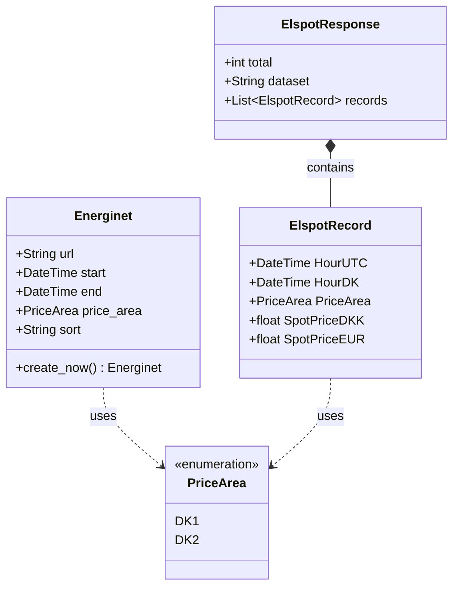

# Elpris Datamodeller

Dette dokument beskriver datamodellerne i `elpris` applikationen, og hvordan de bruges til at håndtere kommunikation med Energinet's API.

## Oversigt

Applikationen bruger Pydantic modeller til at sikre typesikkerhed og automatisk validering af data, både når vi sender forespørgsler og når vi modtager svar fra API'et.

Modellerne er placeret i `elpris/models/` mappen.

## Modeller

### 1. API Respons Modeller (`elpris_models.py`)

Disse modeller bruges til at parse svaret fra Energinet's "Elspotprices" API.

*   **`PriceArea` (Enum)**
    *   Definerer gyldige prisområder: `DK1` (Jylland/Fyn) og `DK2` (Sjælland).
    *   Bruges til at sikre, at vi kun arbejder med gyldige geografiske områder.

*   **`ElspotRecord`**
    *   Repræenterer en enkelt times prisdata.
    *   **Felter:**
        *   `HourUTC`: Tidspunktet i UTC.
        *   `HourDK`: Tidspunktet i dansk tid.
        *   `PriceArea`: Området (DK1/DK2).
        *   `SpotPriceDKK`: Prisen i danske kroner.
        *   `SpotPriceEUR`: Prisen i Euro.
    *   Denne model mapper direkte til felterne i JSON-svaret fra API'et.

*   **`ElspotResponse`**
    *   Repræsentere hele svaret fra API'et.
    *   Indeholder metadata om forespørgslen (total antal rækker, filtre, etc.) samt en liste af `ElspotRecord` objekter i feltet `records`.

### 2. API Forespørgsels Model (`energinet.py`)

Denne model bruges til at konstruere og validere de parametre, vi sender til API'et.

*   **`Energinet`**
    *   Indeholder konfiguration for et API kald.
    *   **Felter:**
        *   `url`: API endpointet (default: `https://api.energidataservice.dk/dataset/Elspotprices`).
        *   `start` & `end`: Tidsperioden for forespørgslen.
        *   `price_area`: Hvilket område der forespørges på.
        *   `sort`: Sortering af data.
    *   **Metoder:**
        *   `create_now()`: Helper metode til at oprette en forespørgsel for det næste døgn fra "nu" i brugerens lokale tidszone.
        *   Serializerer automatisk datoer til korrekt string format (`YYYY-MM-DD`) via `@field_serializer`.

## Dataflow

1.  Applikationen opretter først en instans af `Energinet` modellen (f.eks. via `create_now()`) for at definere hvad der skal hentes.
2.  Denne model konverteres til parametre der sendes til `requests` biblioteket.
3.  Når API'et svarer med JSON data, valideres og parses dette direkte ind i `ElspotResponse` modellen.
4. Dette sikrer at vi straks fanger fejl hvis API'et ændrer format, eller vi modtager uventede data.

## Diagram

